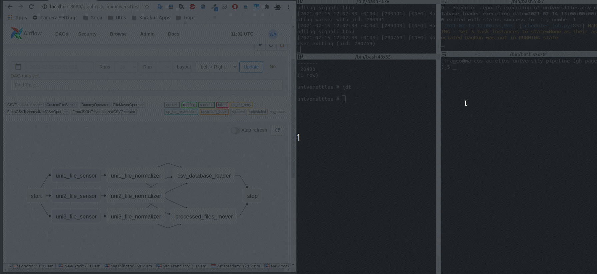

<!-- START doctoc generated TOC please keep comment here to allow auto update -->
<!-- DON'T EDIT THIS SECTION, INSTEAD RE-RUN doctoc TO UPDATE -->

- [Universities Pipeline](#universities-pipeline)
  - [Overview](#overview)
  - [Installing Dependencies](#installing-dependencies)
  - [Configuring Airflow](#configuring-airflow)
  - [Running Airflow](#running-airflow)
  - [Starting the Database Server](#starting-the-database-server)
  - [Configuring the Database](#configuring-the-database)
  - [Airflow in Action](#airflow-in-action)

<!-- END doctoc generated TOC please keep comment here to allow auto update -->

# Universities Pipeline

## Overview

The objective is this project is to showcase some of my data engineering skills, particularly [Apache Airflow](https://airflow.apache.org/).

The idea is collecting input files of different formats (at the moment CSV and JSON) from an "incoming" folder and persisting them into a
database (or warehouse) for data analysis.

We are designing this pipeline considering that the number of data-sets (input files) will increase considerably in the future.

We are using Airflow and adopted the present architecture to create a pipeline that is scalable and easily extendable.

Here's the final Airflow pipeline (DAG):


At the moment, this pipeline only deals with input files of three formats:

- "uni1": CSV with header.
- "uni2": CSV with repeating headers (which need to be filtered out).
- "uni3": JSON.

For the purpose of this demonstration, we have created the following Airflow components:

***Operators***

- `FromCSVToNormalizedCSVOperator`: Normalizes an input CSV file.
- `FromJSONToNormalizedCSVOperator`: Converts an input JSON file to a normalized CSV file.

These operators are configurable by passing a dictionary of mapping and filtering rules for each column:

```python
uni2_rules = {
    'first_name': {
        'column': 0,
        'mapper': MapperGenerator.generate_regex_mapper(r'([^_]+)__([^_]+)', r'\1'),
        'filter': FilterGenerator.generate_regex_filter(r'(?!name)')
    },
    'last_name': {
        'column': 0,
        'mapper': MapperGenerator.generate_regex_mapper(r'([^_]+)__([^_]+)', r'\2'),
        'filter': None
    },
    'subject': {
        'column': 1,
        'mapper': MapperGenerator.generate_copy_mapper(),
        'filter': None
    },
    'grade': {
        'column': 2,
        'mapper': MapperGenerator.generate_copy_mapper(),
        'filter': None
    }
}
```

"uni2.csv" does not contain a "first name" or "last name" columns, only "name" (full name), thus we need a mapping
rule that extracts them from "name".

It also repeats the headers over and over every few records, thus, we need to filter them out by applying a filter.

"mapper" and "filter" are functions. Given that using regular expressions will solve a large portion of the problems,
the package includes the utility method `MapperGenerator.generate_regex_mapper()`, which generates a mapper that
uses regular expressions to extract information and `MapperGenerator.generate_copy_mapper()` which simply copies
the column value without any transformation.

The package also includes `FilterGenerator.generate_regex_filter()` which filters records based on regular expressions.

We may extend this package to include generators that perform more sophisticated mapping and filtering on the data according to your needs.

- `FileMoverOperator`:  Moves a processed file to a "processed" folder (so the file is not processed again when the Airflow job is scheduled to run again, at the moment it runs every hour).
- `CSVDatabaseLoader`: Loads a normalized CSV file to a Postgres database. At the moment it only supports Postgres,
but we may easily add other databases or warehouses (such as Redshift, Athena, Snowflake, BigQuery, etc).

A quick online research revealed that there are about 200 million students enrolled at universities worldwide, with about 20 million in the U.S. alone.

Using Redshift or Snowflake for this purpose might be overkill, but if the infrastructure is available, that's a possibility.

For development purposes (so we can run everything in a local machine), Postgres is the way to go.

***Sensors***

- `CustomFileSensor`: "Senses" when a file (with a particular filename pattern) is copied to an "incoming" directory.

Overall, the idea of this pipeline is the following:

- "uni1_file_sensor", "uni2_file_sensor", and "uni3_file_sensor" sense input files
copied to the incoming directory and pass them on to their respective converters.

- "uni1_file_normalizer", "uni2_file_normalizer", and "uni3_file_normalizer" normalize/convert
the input files sent by the sensors and copy them to the "normalized" folder.

- "csv_database_loader" loads the normalized files into the database.

- "processed_files_mover" moves the input files to the "processed" folder.

For the presentation layer, we have decided for Jupyter. The notebook uses data loaded into the Postgres
database by the pipeline to do some data analysis.

Of course, we always have the option of creating a back-end and a correspondent front-end showing
the most up-to-date statistics for the incoming data. That could be an option if we further developed the solution.

The rendered notebook with the results can be found [here](https://marciogualtieri.github.io/university-pipeline/jupyter/Universities%20Data%20Analysis.html). The original notebook can be found [here](../jupyter/Universities%20Data%20Analysis.ipynb).

This notebook includes some insights extracted from the data, such as:

- Top 3 most popular classes spanning all universities.
- Courses only offer by a single university.
- Passing rate in each university.

It also includes all the ETL required, including de-duplication.

It's important to comment that based on the data analysis, we could improve our pipeline to make the
data even cleaner (for instance, we could have dealt with the de-duplication in the pipeline),
but due to time constraints we have decided to use to Jupyter notebook. This represents the real 
day-to-day process, that is, usually we well get insights from the data analysis phase about
our data that we can use to improve our pipeline.

## Installing Dependencies

All the dependencies are available inside the requirements file:

```
pip install -r requirements.txt
```

## Configuring Airflow 

That's is meant for development only. On production, we might use a cloud service such as AWS,
which makes [Airflow available in the cloud](https://aws.amazon.com/managed-workflows-for-apache-airflow/).

For development purposes, we are setting up Airflow inside our project folder:

```
export AIRFLOW_HOME=~/PycharmProjects/university-pipeline/airflow
```

The "airflow" folder (included in the project) is pre-configured for development purposes.

We also need to create the following soft link so Airflow can find our dags:

```
cd ~/PycharmProjects/university-pipeline/airflow
ln -s ./pipeline/universities airflow/dags
```

Now we need to initialize the database:

```
airflow db init
```

Airflow uses SQLite in development mode.

We also need to create an admin user for accessing Airflow's web based UI:

```
airflow users create -u admin -p admin -r Admin -e admin@airflow -f Admin -l Admin
```

## Running Airflow

Now we may start Airflow's scheduler:

```
airflow scheduler
```

And Airflow's UI:

```
airflow webserver -p 8080
```

Airflow will be available at [here](http://localhost:8080/home).

## Starting the Database Server

For development purposes, we will be using docker. The following command will start a Postgres server:

```
docker run --name universities -e POSTGRES_PASSWORD=postgres -d -p 5432:5432 postgres
```

## Configuring the Database

We now may connect the database server and create a development database:

```
docker exec -it universities bash
```

Start a `plsql` session:

```
su postgres
psql
```

Create a database "universities":

```
CREATE DATABASE universities;
```

We may now connect to our database for debugging purposes:

```
psql universities
```

You will also need to configure a database connection in Airflow by navigating to `Admin > Connections` in Airflow's UI:


The connection id needs to be named "universities".

## Airflow in Action

Follows a screen capture of Airflow running:


